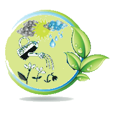

# ioBroker.sprinklecontrol

 

## sprinklecontrol adapter for ioBroker

This adapter controls individual irrigation circuits in the garden. Depending on the weather and soil conditions, they start working at a specific time or at sunrise, as specified in the configuration.

Wetterabhängige automatische Steuerung der Gartenbewässerung

[Deutsche Beschreibung hier](docs/de/sprinklecontrol.md)

[English Description here](docs/en/sprinklecontrol.md)

[Deutsche Beschreibung auf GitHub](https://github.com/Dirk-Peter-md/ioBroker.sprinklecontrol/blob/master/docs/de/sprinklecontrol.md)

*************************************************************************************************************************************

## Changelog

<!--
  Placeholder for the next version (at the beginning of the line):
  ### **WORK IN PROGRESS**
-->

 ### **WORK IN PROGRESS**
 * (Dirk-Peter-md) Water Pressure Control Revised
 * (Dirk-Peter-md) ioBroker-Bot [E6004], [W1127], [W1133], [W1134], [S6022] completed

### 1.0.7 (2026-05-24)
* (Dirk-Peter-md) Added pressure monitoring.

### 1.0.6 (2026-05-10)
* (Dirk-Peter-md) Cistern Control Optimized
* (Dirk-Peter-md) Translation revised

### 1.0.5 (2026-05-03)
* (Copilot) Adapter benötigt jetzt node.js >= 22
* (Dirk-Peter-md) Second start time added
* (Dirk-Peter-md) bug fixed in sprinklerState

### 1.0.4 (2026-04-26)
* (Dirk-Peter-md) GitHub error message #274

### 1.0.3 (2026-04-25)
* (Dirk-Peter-md) Pressure relief valve added after irrigation.

### CHANGELOG_OLD
[CHANGELOG_OLD.md](CHANGELOG_OLD.md)

*************************************************************************************************************************************

## License
[MIT License](LICENSE)
