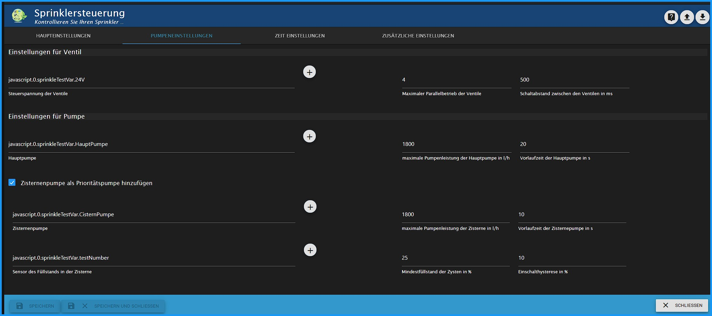

## Sprinklercontrol ist ein Adapter zur automatischen Steuerung der Gartenbewässerung.
# Grundlegendes

In Sprinklecontroll werden die Umweltdaten (Temperatur, Luftfeuchtigkeit, Helligkeit, Windgeschwindigkeit, Regenmenge) ausgewertet. Die so ermittelte Verdunstung dient der Steuerung der Ventile, der einzelnen Sprängerkreise.
Meine Bewässerung arbeitet mit dem Homematic IP Wettersensor plus (HmIP-SWO-PL) und wurde nur mit diesem getestet.

## Installation
Der Adapter befindet sich auf GitHub (https://github.com/Dirk-Peter-md/ioBroker.sprinklecontrol). Von hier kann er heruntergeladen werden. 
Um ihn installieren zu können muss man in den Adapter von ioBroker gehen und dort "Installieren aus eigener URL" anklicken. 
Unter beliebig kann dann der URL Pfad (https://github.com/Dirk-Peter-md/ioBroker.sprinklecontrol) eingegeben werden.

Spätestens nach Refresh der Adapterliste steht der Adapter **Sprinklecontrol** zur Verfügung.

Nach anklicken des (+) wird eine Instanz angelegt und die notwendigen Daten des Adapters vom Repository geladen:

# Konfiguration - Haupteinstellungen
Sollte in dem Installationsfenster die Checkbox "***schließen wenn fertig***" nicht angehakt sein muss man dieses natürlich noch schließen.

Das Konfigurationsfenster besteht aus drei Reitern:
* Haupteinstellungen
* Pumpeneinstellungen
* Zeit-Einstellungen
* Extra-Einstellungen

Das Konfigurationsfenster öffnet sich automatisch mit den Haupteinstellungen

Auf dieser Seite ist eine Beispiel-ID abgelegt.
Diese bitte löschen und anschließend die eigenen IDs durch anklicken des (+) links oben über der Tabelle die eigenen Sprinkleraktoren hinzufügen.

Dabei bitte die Datenpunkte mit STATE (o.ä.) auswählen. NICHT das Gerät als solches.

Nach Abschluß der ID-Auswahl ist der Adapter bereits betriebsbereit, aber noch nicht an die eigenen Wünsche angepasst.

### Aufbau der Tabelle

**Nr**:  fortlaufende Nummer der gelisteten Bewässerungskreise

**Aktiv**: Checkbox zur Aktivierung der Steuerung des entsprechenden Bewässerungskreises

**Name**: Name des Aktors; wird bei der Auswahl der ID automatisch aus den Objekten eingelesen. Dieser Name des Aktors kann individuell angepasst werden. Es dürfen aber keine Duplikate vorkommen.

**Objekt-ID-Sprinkler**: Eindeutige ID des zu steuernden Datenpunkts in den Objekten

**(+)**: Hinzufügen/Ändern der ID

**Bleistift**: spezifische Konfiguration des jeweiligen Rollladens

**Pfeile**: verändern der Reihenfolge der verschiedenen Rollläden

**Mülleimer**: Löschen der ID mit allen Konfigurierten Daten!

## individuelle Konfiguration eines Bewässerungskreises
Auch diese Konfigurationsebene besteht aus zwei Reitern: **Haupteinstellungen** und **Pumpeneinstellungen**

---

### Haupteinstellungen

* **Bewässerungsdauer**
* **maximale Bewässerungsverlängerung in %**
* **Bewässerungsinterval**
* **niedrigster Prozentsatz der Bodenfeuchte**
* **Bedenfeuchte = 100 % nach der Bewässerung**
* **maximale Bewässerung nach der Bewässerung**
* **maximale Bodenfeuchte nach einem Regen**

---

### Pumpeneinstellungen

* **Durchflussmenge**
* **Booster**

---
---

# Konfiguration - Pumpen-Einstellungen
Hier werden die Einstellung der Hauptpumpe und der Spannungsversorgung der Regelkreise vorgenommen.

* **Einstellung der Ventile**

    * **Rollladenhöhe beim runterfahren:**
    * **Maximaler Parallelbetrieb der Ventile**
    
* **Einstellung der Pumpe:**
    * **Hauptpumpe**
    * **maximale Pumpenleistung der Hauptpumpe in  l/h**

* **Zisternenpumpe als Prioritätspumpe hinzufügen** (noch nicht programmiert, aber in Planung)
    * **Zisternenpumpe** (noch nicht programmiert, aber in Planung)
    * **maximale Pumpenleistung der Zisterne in l / h** (noch nicht programmiert, aber in Planung)
    * **Höhe der Zisterne** (noch nicht programmiert, aber in Planung)
    * **Mindestfüllstand der Zysten in%** (noch nicht programmiert, aber in Planung)

---
---

# Konfiguration - Zeit-Einstellungen
In diesem Abschnitt werden die Startzeiten von Sprinklercontrol festgelegt

## Startzeit für die Bewässerung

* **Beginnen Sie mit einer festen Startzeit**
    * **Startzeit in der Woche**
* **Startzeit bei Sonnenaufgang**
    * **Zeitverschiebung**
* **Startzeit am Ende der goldenen Stunde**

---
* **andere Startzeit am Wochenende**
    * **Startzeit am Wochenende**
    * **Startzeit der Feiertage wie am Wochenende**
        * **Feiertage Instanz**

---
---

# Konfiguration - Zusätzliche-Einstellungen

In den Extra-Einstellungen werden verschiedene Einstellungen eingegeben, die bei der Berechnung der Verdunstung unerlässlich sind.

## Astro-Einstellungen
Diese Einstellungen sind eigentlich selbsterklärend: Breiten- und Längengrad des Wohnorts um den Sonnenstand korrekt berechnen zu können.

* **Breitengrad:** Hier kann ein Offset eingegeben werden um den sich die Rollladenfahrten für hoch bzw. runter von den später ausgewählten Astro-Events verschieben soll.

* **Längengrad** Damit nicht alle Rollläden gleichzeitig fahren, kann hier eine Zeit in Sekunden für eine Verzögerung eingestellt werden.

## Debug-Einstellungen

* **debuggen** 

## Verdunstungsberechnungssensoren

* **Temperatursensor**
* **Feuchtigkeitssensor**
* **Windgeschwindigkeitssensor**
* **Helligkeitssensor**
* **Regensensor**